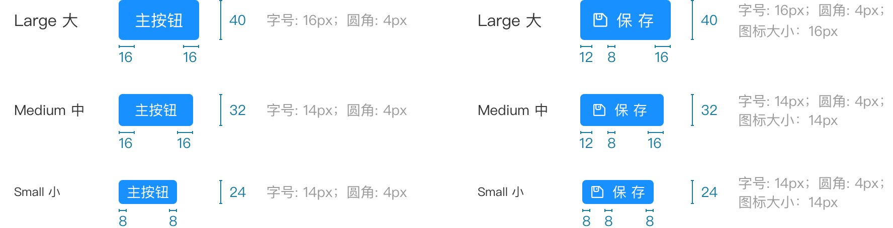

::: style
``` js
require('./style.less')
```
:::

<div class='button-md'>

# Button 按钮

按钮用于开始一个即时操作。使用场景：标记了一个（或封装一组）操作命令，响应用户点击行为，触发相应的业务逻辑。

### · 按钮类型

按钮有四种类型：主按钮、次按钮、虚线按钮、危险按钮。主按钮在同一个操作区域最多出现一次。

:::
测试`note`
```jsx
import React from 'react';
import {Button} from '@/ui';
function Demo() {
    return (
        <React.Fragment>
            <Button type='primary'>主按钮</Button>
            <Button>次按钮</Button>
            <Button type='dashed'>虚框按钮</Button>
            <Button type='danger'>危险按钮</Button>
        </React.Fragment>
    )
}
```
:::

### · 图标按钮

带图标的按钮可增强辨识度（有文字）或节省空间（无文字）。

::: 
```jsx
import React from 'react';
import {Button} from '@/ui';
function Demo() {
    return (
        <React.Fragment>
            <Button shape='circle' prefix='save' type='primary'></Button>
            <Button type='primary' prefix='save'>保存</Button>
            <Button prefix='save' shape='circle'></Button>
            <Button prefix='save' >保存</Button>
            <Button prefix='save' type='dashed' shape='circle'></Button>
            <Button prefix='save' type='dashed'>保存</Button>

        </React.Fragment>
    )
}
```
:::

### · 组合按钮
以按钮组的方式出现，常用于多项类似操作。

:::
```jsx
import React from 'react';
import {Button} from '@/ui';
function Demo() {
    const Group = Button.Group
    return (
        <Group>
            <Button >杭州</Button>
            <Button >上海</Button>
            <Button >成都</Button>
            <Button >武汉</Button>
        </Group>
    )
}
```
:::

### · 幽灵按钮
幽灵按钮将按钮的内容反色，背景变为透明，常用在有色背景上。

:::
```jsx
import React from 'react';
import {Button} from '@/ui';
function Demo() {
    return (
        <div style={{
            background: '#C8CBDA',
            height: 60,
            padding: '14px 0'
            }}>
            <Button ghost={true} type='primary'>主按钮</Button>
            <Button ghost={true}>次按钮</Button>
            <Button ghost={true} type='dashed'>虚框按钮</Button>
            <Button ghost={true} type='danger'>危险按钮</Button>
        </div>
    )
}
```
:::


### · 按钮尺寸
按钮有大、中、小三种尺寸。

:::
```jsx
import React from 'react';
import {Button} from '@/ui';
class Demo extends React.Component {
    constructor(){
        super()
        this.state = {
            size: 'default'
        }
    }
    toggle(v){
        this.setState({size: v})
    }
    render() {
        const Group = Button.Group
        return (
            <div className='btn-size-demo'>
                <Group>
                    <Button onClick={this.toggle.bind(this, 'large')} size={this.state.size}>大</Button>
                    <Button onClick={this.toggle.bind(this, 'default')} size={this.state.size}>中</Button>
                    <Button onClick={this.toggle.bind(this, 'small')} size={this.state.size}>小</Button>
                </Group>
                <br/>
                <Button type='primary' size={this.state.size}>主按钮</Button>
                <Button size={this.state.size}>次按钮</Button>
                <Button type='danger' size={this.state.size}>删除</Button>
                <Button type='primary' size={this.state.size} prefix='loading' shape='circle'></Button>
            </div>
        )
    }
}
```
:::


#### 设计规范




### · 按钮特殊状态
按钮的特殊状态：加载中状态。

::: only
```jsx
import React from 'react';
import {Button} from '@/ui';
class Demo extends React.Component {
    constructor(){
        super()
        this.state = {
            isLoading: false
        }
    }
    loading() {
        this.setState({isLoading: true})
    }
    render() {
        return (
            <React.Fragment>
                <Button 
                    prefix={this.state.isLoading?'loading':null}
                    disabled={this.state.isLoading} 
                    type='primary' 
                    onClick={this.loading.bind(this)}
                >
                    {this.state.isLoading? '正在':'点击'}加载
                </Button>
                <Button prefix='loading' type='primary' shape='circle'></Button>
            </React.Fragment>
        )
    }
}
```
:::

### · 按钮常规状态

按钮的常规状态：默认状态、悬停状态、点击状态、失效状态。

::: only
```jsx 
import React from 'react';
import {Button} from '@/ui';
function Demo() {
    return (
        <div className='btn-status-demo' >
            <div className='_left'>
                <div className='_btn-demo__block'>
                    <p >默认</p>
                    <Button type='primary'>主按钮</Button>
                </div>
                <div className='_btn-demo__block'>
                    <p  >悬停</p>
                    <Button type='primary' style={{background:'#41a4ff', borderColor:'#41a4ff' }}>主按钮</Button>
                </div>
                <div className='_btn-demo__block'>
                    <p >点击</p>
                    <Button type='primary' style={{background:'#0976db', borderColor:'#0976db' }}>主按钮</Button>
                </div>
                <div className='_btn-demo__block'>
                    <p >失效</p>
                    <Button type='primary' disabled>主按钮</Button>
                </div>
            </div>
            <div className='_right'>
                <div className='_btn-demo__block'>
                    <p >默认</p>
                    <Button>次按钮</Button>
                </div>
                <div className='_btn-demo__block'>
                    <p  >悬停</p>
                    <Button style={{background:'#fff',color:'#41a4ff',borderColor:'#41a4ff' }}>次按钮</Button>
                </div>
                <div className='_btn-demo__block'>
                    <p >点击</p>
                    <Button style={{background:'#fff',color:'#0976db',borderColor:'#0976db' }}>次按钮</Button>
                </div>
                <div className='_btn-demo__block'>
                    <p >失效</p>
                    <Button disabled>次按钮</Button>
                </div>
            </div>
        </div>
    )
}
```
:::

### · 文字按钮
没有边框和背景色的按钮。

::: only
```jsx 
import React from 'react';
import {Button} from '@/ui';

function Demo() {
    return (
        <React.Fragment>
            <Button 
                style={{
                    background:'none',
                    border:'none',
                    color: '#1890FF'
                }} 
                type='primary'
            >主按钮</Button>
            <Button 
                style={{
                    background:'none',
                    border:'none',
                    color: '#1890FF'
                }}
                ghost
                type='primary'
                disabled
             >虚框按钮</Button>
        </React.Fragment>
    )
}
```
:::

### · API
通过设置 Button 的属性来产生不同的按钮样式，推荐顺序为：type -> shape -> size -> icon -> disabled。

| 名称       | 说明                                               | 类型      | 默认值    |
| ---------- | --------------------------------------------------| --------- | -------- |
| `htmlType` | 等同于原生按钮的`type`属性                          | `string`  | `button` |
| `type`     | 按钮类型。可选`primary`\|`dashed`\|`danger`或不设置 | `string`  | -        |
| `size`     | 按钮尺寸。可选`large`\|`small`或不设置              | `string`  | -        |
| `shape`    | 按钮形状。可选`circle`\|`square`或不设置            | `string`  | -        |
| `icon`     | 定义要在按钮中显示的图标类型                         | `string`  | -        |
| `ghost`    | 将按钮背景色设为透明                                | `boolean` | `false`  |
| `disabled` | 禁用按钮                                           | `boolean` | `false`  |

除了以上的API，其他所有可以传递给原生`button`元素的属性都有效，例如：`onClick`、`className`。

</div>